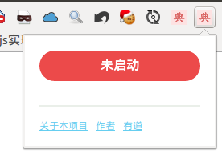
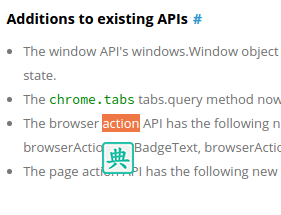
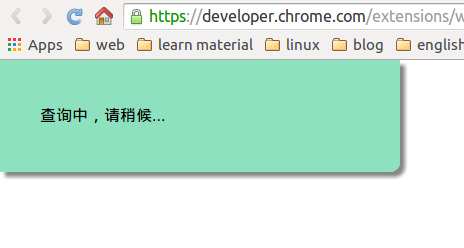
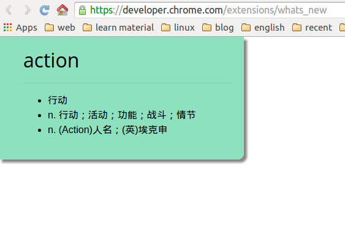

# youdao-chrome-extension 插件制作

## 项目实际效果

## 项目亮点

- 利用 `xhr`  `cors` 技术实现内容的抓取
- http，https 网站均可进行翻译，通过将请求的数据的 `http`://fanyi.youdao.com/translate?smartresult=dict&smartresult=rule&smartresult=ugc&sessionFrom=null 改为 `https`://fanyi.youdao.com/translate?smartresult=dict&smartresult=rule&smartresult=ugc&sessionFrom=null
- 体验的翻译速度还算 `比较满意`，视觉感也还算 `比较满意`

## 项目操作步骤

- 安装 gulp gulp-plumber gulp-jade gulp-htmlmin gulp-less gulp-minify-css gulp-jshint jshint gulp-uglify
- 编写 gulpfile.js 文件
- 编写 manifest.json 文件
- 学习 jade 的简单使用，并首次使用来编写 popup.jade 文件
- 使用 less 来编写 popup.less 文件
- 编写 popup.js 文件，并阅读相关 [文档](https://developer.chrome.com/extensions/storage)
- 编写 show.js 文件

    - 对 `抓包` 更加的熟悉 - 由于 [有道翻译](http://fanyi.youdao.com/) 是通过 `enter` 键触发 `xhr` 请求通过 `post` 来加载数据的，因此仅需要抓 `xhr` 类型的请求
    - 使用 `XMLHttpRequest` 并配合 `manifest.json 文件中的 permissions` 来进行 `跨域请求`，通过 console 得知 https 请求的也必须是 https ，于是便将     `http`://fanyi.youdao.com/translate?smartresult=dict&smartresult=rule&smartresult=ugc&sessionFrom=null 改为 `https`://fanyi.youdao.com/translate?smartresult=dict&smartresult=rule&smartresult=ugc&sessionFrom=null，避免受到攻击
    - 对返回的数据使用 <http://www.runoob.com/jsontool> 这个在线工具进行格式化以方便查看
    - 对得到的 `json` 格式的 `responseText` 数据进行解析

- 项目目标达到，开始进行代码优化

    - 将原先写在 show.js 中通过 dom 改变样式的代码分离出来，创建 show.less ，达到样式与行为分离，方便代码错误检测和管理
    - 将汇集在一个函数中的大量代码根据功能进行分离，创建小函数，方便查看代码逻辑以及错误检测

## 学习总结

- Jade 学习总结

    - 有一个简单的语法网站 <https://naltatis.github.io/jade-syntax-docs/>
    
- 跨域简单学习

    - 学习资料 
        
        - <http://segmentfault.com/a/1190000000702539>
        - <http://mp.weixin.qq.com/s?__biz=MzAwNDYwNzU2MQ==&mid=401070697&idx=1&sn=69771218c42277dd0eb2427429f2cd82&scene=0#wechat_redirect>
        
- JSON 数据解析处理

    - 学习资料 <http://www.liaoxuefeng.com/wiki/001434446689867b27157e896e74d51a89c25cc8b43bdb3000/001434499490767fe5a0e31e17e44b69dcd1196f7ec6fc6000>
    
## 结束语

本项目自己独立完成，全靠官方文档和 google 搜索。总结出了一小点经验，有些知识还是带目的性的去学 - 边学边想着做个什么东西，这样才比较有效果，有目的性的学习。加油↖(^ω^)↗
